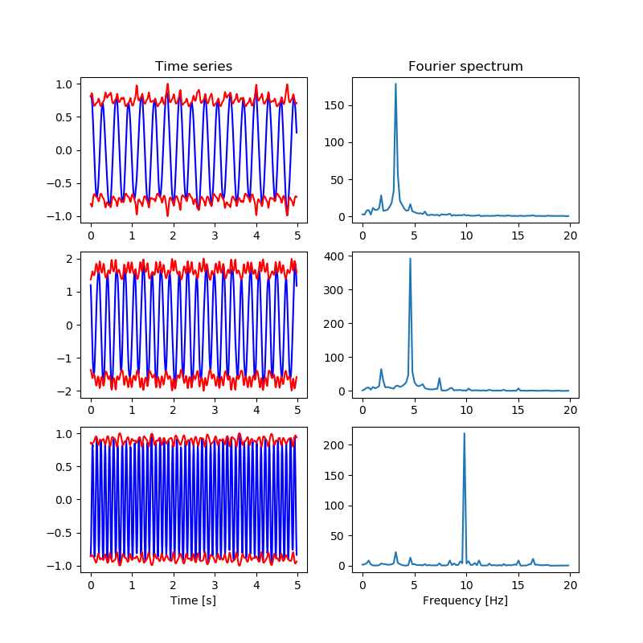

# KurSL

## Overview

*KurSL* is a mathematical model, which provides explanation for interacting oscillatory patterns. It is constructed of two components: Kuramoto coupling and Sturm-Liouville eigenvalue equation. The first one explains coupling between oscillators, and the latter provides a general oscillatory model. To read more about the method 

## Examples

The example below was produced using the *KurSL* model. It was generated assuming three oscillators with up to second harmonic coupling.
For the code on how this example was generated please see `examples/kursl_example.py`.

