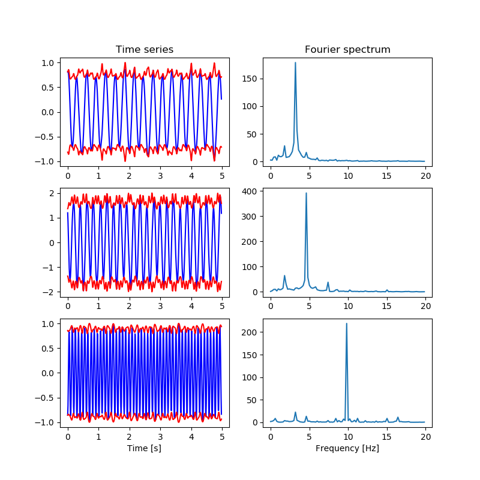

|BuildStatus| |codecov| |Codacy|

KurSL
=====

*KurSL* is a mathematical model, which provides explaination for interacting oscillatory patterns. It is constructed of two components: Kuramoto coupling and Sturm-Liouville eigenvalue equation. The first one explains coupling between oscilaltors, and the latter provides a general oscillatory model. More details on the model will be provided at `homepage <https://www.laszukdawid.com>`_.

Examples
========

Example below was produced using the *KurSL* model. It was generated assuming three oscillators with up to second harmonic coupling.
For code on how this example was generated please see kursl_example.py_.

.. _kursl_example.py: ./examples/kursl_example.py

.. |codecov| image:: https://codecov.io/gh/laszukdawid/KurSL/branch/master/graph/badge.svg
   :target: https://codecov.io/gh/laszukdawid/KurSL
.. |BuildStatus| image:: https://travis-ci.org/laszukdawid/KurSL.png?branch=master
   :target: https://travis-ci.org/laszukdawid/KurSL
.. |Codacy| image:: https://api.codacy.com/project/badge/Grade/67d2a4141b0843fc89d770ca7f8ac20d
   :alt: Codacy Badge
   :target: https://www.codacy.com/app/laszukdawid/KurSL?utm_source=github.com&amp;utm_medium=referral&amp;utm_content=laszukdawid/KurSL&amp;utm_campaign=Badge_Grade
